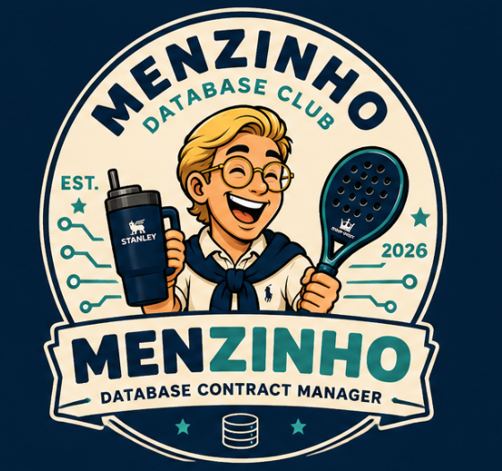

# db-man

<p align="center">
  
</p>

`db-man` generates application persistence code from database schema repositories.

The first adapter supports Python/FastAPI applications that use SQLAlchemy and Pydantic. `db-man` also supports TypeScript/Next.js applications that use Prisma, such as Arcadia. The database repository remains the owner of migrations and schema files; `db-man` consumes that contract and writes compatible files inside each application repository.

## Requirements

- Node.js and npm to install and run the CLI.
- Git to clone, fetch, or update database repositories.
- GitHub CLI (`gh`) is optional. When available and authenticated, `db-man init` uses it to list GitHub repositories ending in `-database`. Without `gh`, the CLI still works by finding local sibling repositories or by letting you enter the repository name and Git URL manually.

## Install

From the npm registry:

```bash
npm install -g @amicci-labs/db-man
```

From GitHub, without publishing to npm:

```bash
npm install -g github:amicci-labs/db-man
```

For private repositories, use SSH access:

```bash
npm install -g git+ssh://git@github.com/amicci-labs/db-man.git
```

For GitHub Packages, configure npm first:

```text
@amicci-labs:registry=https://npm.pkg.github.com
//npm.pkg.github.com/:_authToken=YOUR_GITHUB_TOKEN
```

Then install with the same package name:

```bash
npm install -g @amicci-labs/db-man
```

For local development in this workspace:

```bash
cd db-man
npm install
npm run build
npm install -g .
```

Check the binary:

```bash
db-man --help
```

## Initialize An App

Run this from the application repository root, for example `fintech-api`:

```bash
db-man init
```

The command creates a `.dbman` file like this:

```json
{
  "databaseRepository": {
    "name": "fintech-database",
    "gitUrl": "git@github.com:amicci-labs/fintech-database.git"
  },
  "application": {
    "language": "python",
    "framework": "fastapi",
    "repositoryProvider": "sqlalchemy"
  }
}
```

For a TypeScript/Next.js application that uses Prisma, such as `arcadia`, use:

```json
{
  "databaseRepository": {
    "name": "arcadia-database",
    "gitUrl": "git@github.com:amicci-labs/arcadia-database.git"
  },
  "application": {
    "language": "typescript",
    "framework": "nextjs",
    "repositoryProvider": "prisma"
  }
}
```

After creation, the CLI suggests:

```bash
db-man generate --dry-run
db-man generate
```

## Generate

Preview generated files without changing the app:

```bash
db-man generate --dry-run
```

Apply changes:

```bash
db-man generate
```

The Python/FastAPI SQLAlchemy adapter writes:

- `app/database/models.py`
- `app/database/schemas.py`
- `app/repositories/<table>_repository.py`

For PostgreSQL `schema.sql` sources, the adapter preserves:

- native enums in SQLAlchemy models and Pydantic `Literal` types;
- named and unnamed `CHECK` constraints;
- normal, unique, composite, ordered, and partial indexes;
- simple and composite foreign keys;
- literal defaults and database-generated expression defaults.

PostgreSQL-specific checks and indexes remain in SQLAlchemy metadata but are emitted only for the PostgreSQL dialect, keeping SQLite-based application tests usable.

The TypeScript/Next.js Prisma adapter writes:

- `prisma/schema.prisma`

After writing files, the Prisma adapter automatically runs the app's local Prisma CLI from `node_modules/.bin/prisma generate` so `@prisma/client` reflects the updated schema. Install the application dependencies before running `db-man generate`; `db-man` does not download Prisma on demand because that can accidentally use an incompatible major version.

## Schema Resolution

When `db-man generate` runs, it reads `.dbman`, selects the configured adapter, resolves the configured database repository, finds a compatible `schema.prisma` or `schema.sql`, and builds a file plan. The default schema resolution prefers `src/db/schema.sql`, then `prisma/schema.prisma`, then searches the repository for the first compatible schema file while skipping directories such as `.git`, `node_modules`, and `dist`. Adapters can narrow this list; the Prisma adapter only accepts `schema.prisma`.

The Prisma adapter requires `schema.prisma` because Prisma Client types are generated from that contract. SQL schemas remain supported by adapters that can translate `schema.sql` directly, such as the Python/FastAPI SQLAlchemy adapter.

Repository resolution order:

1. Use a local sibling repository with the configured name, for example `../fintech-database`, when it exists.
2. Use a local path when `databaseRepository.gitUrl` is a local path.
3. Use the cached clone in `~/.db-man/repositories/<name>` and update it.
4. Clone from `databaseRepository.gitUrl` into the cache.

The CLI prints which source it used, for example:

```text
Using local sibling repository ../fintech-database
```

This matters during local development: generated files may reflect local database schema changes that have not been pushed to GitHub yet.

## Release

Before publishing or tagging a release, validate the package:

```bash
npm ci
npm run build
npm pack --dry-run
```

Publish to the npm registry:

```bash
npm publish --access public
```

Install after publishing:

```bash
npm install -g @amicci-labs/db-man
```

## Adapter Model

Generators are registered by application language, framework, and repository provider. New adapters can be added under `src/generators`, for example:

- `node-nestjs-prisma`
- `node-nestjs-drizzle`
- `python-fastapi-sqlmodel`
- `python-fastapi-sqlalchemy`
